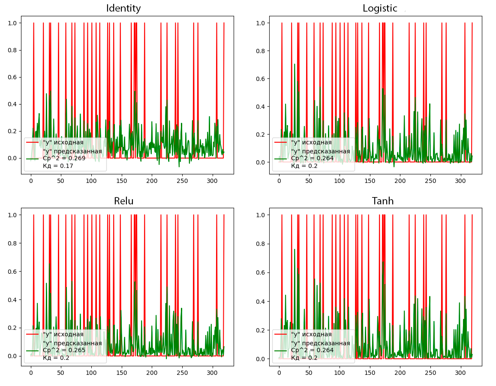

## Лабораторная работа 7. Вариант 4.
### Задание 
- Выбрать художественный текст и обучить на нем рекуррентную нейронную сеть 
для решения задачи генерации. 
- Подобрать архитектуру и параметры так, 
чтобы приблизиться к максимально осмысленному результату. 
- Подобрать компромиссную архитектуру, справляющуюся 
достаточно хорошо русским и английским текстами.

### Как запустить
Для запуска программы необходимо с помощью командной строки в корневой директории файлов прокета прописать:
```
python main.py
```
Результат выполнения программы будет выведен в консоль.
> **Error**
>
> Данное решение использует конфигурацию, созданную на основе комплектующих машины, на которых она запущена. Запуск программы на машинах с отличной конфигурацией может привести к ошибкам.

### Используемые технологии
- Библиотека `numpy`, используемая для обработки массивов данных и вычислений
- Библиотека `sys`, используемая для потокового вывода данных в консоль.
- Библиотека `nltk` - (Natural Language Toolkit) библиотека для обработки естественного языка, используемая для предобработки текста:
    - `RegexpTokenizer` - инструмент для токенизации текста на основе регулярных выражений.
    - `stopwords` - коллекция стоп-слов корпуса языка.
- Библиотека `tensorflow` - открытая библиотека глубокого обучения, используемая для создания и обучения моделеи машинного обучения, основанной на рекурентной нейронной сети.
- Библиотека `keras` - высокоуровневая библиотека глубокого обучения:
    - `Sequential` - класс, который представляет собой линейную стековую модель нейронной сети.
    - `Dense`, используемый для создания слоя, в котором каждый нейрон соединен со всеми нейронами в предыдущем слое.
    - `Dropout` - метод регуляризации, который применяется в нейронных сетях для борьбы с переобучением. Он заключается во временном исключении случайно выбранных нейронов во время обучения модели.
    - `LSTM` -  (Long Short-Term Memory) тип рекуррентной нейронной сети, который используется для обработки последовательностей данных. Он отличается от обычных рекуррентных нейронных сетей (RNN) своей способностью эффективно улавливать долгосрочные зависимости в последовательностях.

### Описание работы
#### Предобработка текстовых данных

Нам нужно преобразовать наш вводимый текст в числа, а затем обучить модель последовательностям этих чисел. 

Для начала загрузим текстовые данные. У нас это будет небольшое современное художественное произведение примерно на 180 строк тектса:
```python
file = open("P:\\ULSTU\\ИИС\\Лабораторные\\Lab7\\texts\\text-ru.txt", encoding='utf-8').read()
```
Теперь переведём текст в нижний регистр, и создадим токены из слов с помощью `NLTK`. 
```python
input = input.lower()
tokenizer = RegexpTokenizer(r'\w+')
tokens = tokenizer.tokenize(input)
```
Отфильтруем список токенов и оставим только те токены, которых нет в списке стоп-слов или общих слов русского корпуса, дающих мало информации о рассматриваемом предложении, с помощью `NLTK`:
```python
filtered = filter(lambda token: token not in stopwords.words('russian'), tokens)
```
Теперь преобразуем символы нашего текста в числа: 
- Отсортируем список из набора всех символов, которые появляются во входном тексте.
- Получим числа, представляющие символы с помощью `enumerate`.
- Создадим словарь, в котором хранятся символы и числа, которые их представляют.
```python
chars = sorted(list(set(processed_inputs)))
char_to_num = dict((c, i) for i, c in enumerate(chars))
input_len = len(processed_inputs)
vocab_len = len(chars)
```
Также сохраним общее кол-во символов и размер словаря для создания набора данных.

#### Создание набора данных

Для начала необходимо задать длину последовательности (одно полное отображение входных символов в целые числа). Укажем её размер равный 100. 

Теперь необходимо пройти весь список входов и преобразовать символы в числа, для создания групп последовательностей входных и выходных данных для обучения:
```python
seq_length = 100
x_data = []
y_data = []
for i in range(0, input_len - seq_length, 1):
    in_seq = processed_inputs[i:i + seq_length]
    out_seq = processed_inputs[i + seq_length]
    x_data.append([char_to_num[char] for char in in_seq])
    y_data.append(char_to_num[out_seq])
n_patterns = len(x_data)
print("Кол-во паттернов:", n_patterns)
```
Также выведем общее кол-во обучающих последовательностей (паттернов).

Преобразуем входные последовательности в обработанный массив `numpy`, с преобразованием значений массива `numpy` в числа с плавающей запятой, чтобы функция активации сигмоида, которую использует рекурентная нейронная сеть, могла интерпретировать их и выводить вероятности от 0 до 1.
```python
X = np.reshape(x_data, (n_patterns, seq_length, 1))
X = X / float(vocab_len)
y = np_utils.to_categorical(y_data)
```

#### Разработка архитектуры модели

Создадим модель `LSTM` типа `Sequential` и добавим слои:
```python
model.add(LSTM(256, input_shape=(X.shape[1], X.shape[2]), return_sequences=True))
model.add(Dropout(0.2))
model.add(LSTM(256, return_sequences=True))
model.add(Dropout(0.2))
model.add(LSTM(256))
model.add(Dropout(0.2))
model.add(Dense(y.shape[1], activation='softmax'))
```
- 1й слой - слой в 256 нейронов по размерности входных данных с обратными зависимостями.
- 2й слой - слой в 256 нейронов с обратными зависимостями
- 3й слой - слой в 256 нейронов

Между каждыми слоями используется функция `Dropout` для случайного исключения нейронов с вероятностью 0.2 в целях борьбы с переобучением.

После этого компилируем модель и обучаем. Лучшие модели с наименьшими ошибками определения связей символов будут сохраняться в файл. Добавим функцию для вывода сгенерированного текста:

```python
start = np.random.randint(0, len(x_data) - 1)
pattern = x_data[start]
print("Случайная выборка:")
print("\"", ''.join([num_to_char[value] for value in pattern]), "\"")

for i in range(1000):
    x = np.reshape(pattern, (1, len(pattern), 1))
    x = x / float(vocab_len)
    prediction = model.predict(x, verbose=0)
    index = np.argmax(prediction)
    result = num_to_char[index]
    sys.stdout.write(result)
    pattern.append(index)
    pattern = pattern[1:len(pattern)]
```
В качестве стартового набора для генерации используем случайную выборку слов текста. 

#### Оптимизация модели

Рекурентные нейронные сети основаны на матричных вычислениях, которых в данной модели огромное количество. Процессор обрабатывает такие данные достаточно медленно (к примеру на данной машине время выполнение одной эпохи обучения ресурсами процессора было около 50 минут). Однако, рекурентные сети способны учиться и на графических картах. 

На данной машине установлена GPU NVidia GTX 980Ti с графической памятью DDR6 на 4Гб. Чтобы использовать её для вычислений, необходимо установить ПО от NVidia - `CUDA` и драйвер `cudnn`. После этого необходимо установить `tensorflow` с поддержкой GPU, задать ему конфигурации машины и настроить распределённую архитектуру вычислений:
```python
strategy = tf.distribute.MultiWorkerMirroredStrategy()
with strategy.scope():
    parallel_model = model
parallel_model.fit(X, y, epochs=200, batch_size=256, callbacks=desired_callbacks)
```
Данная стратегия распределяет вычисления на ЦП и ГП в зависимости от их загруженности. С ней время одной эпохи обучения скратилось до 50 секунд.

Нагрузка на ЦП и ГП во время обучения: 


#### Генерация текста
Информация о входных данных: 
```
Общее кол-во символов: 31258
Размер словаря: 34
Кол-во паттернов: 31158
```
Сгенерируем русский текст на 5 эпохах обучения:
```
Epoch 1/5
122/122 [==============================] - ETA: 0s - loss: 3.1638
Epoch 1: loss improved from inf to 3.16378, saving model to model_weights_saved.hdf5
...
Epoch 5/5
122/122 [==============================] - ETA: 0s - loss: 3.0314
Epoch 5: loss improved from 3.08348 to 3.03140, saving model to model_weights_saved.hdf5
Случайная выборка:
" ти могли привлекать чужой взгляд сводить ума молить помиловании тёмные полосы тени высоких деревьев  "
ооо  ооо  ооо  ооо  ооо  ооо  ооо  ооо  ооо  ооо  ооо  ооо  ооо  ооо  ооо  ооо  ооо  ооо  ооо  ооо  ооо  ооо  ооо  ооо  ооо  ооо  ооо  ооо  ооо  ооо  ооо  ооо  ооо  ооо  ооо  ооо  ооо  ооо  ооо  ооо  ооо  ооо  ооо  ооо  ооо  ооо  ооо  ооо  ооо  ооо  ооо  ооо  ооо  ооо  ооо  ооо  ооо  ооо  ооо  ооо  ооо  ооо  ооо  ооо  ооо  ооо  ооо  ооо  ооо  ооо  ооо  ооо  ооо  ооо  ооо  ооо  ооо  ооо  ооо  ооо  ооо  ооо  ооо  ооо  ооо  ооо  ооо  ооо  ооо  ооо  ооо  ооо  ооо  ооо  ооо  ооо  ооо  ооо  ооо  ооо  ооо  ооо  ооо  ооо  ооо  ооо  ооо  ооо  ооо  ооо  ооо  ооо  ооо  ооо  ооо  ооо  ооо  ооо  ооо  ооо  ооо  ооо  ооо  ооо  ооо  ооо  ооо  ооо  ооо  ооо  ооо  ооо  ооо  ооо  ооо  ооо  ооо  ооо  ооо  ооо  ооо  ооо  ооо  ооо  ооо  ооо  ооо  ооо  ооо  ооо  ооо  ооо  ооо  ооо  ооо  ооо  ооо  ооо  ооо  ооо  ооо  ооо  ооо  ооо  ооо  ооо  ооо  ооо  ооо  ооо  ооо  ооо  ооо  ооо  ооо  ооо  ооо  ооо  ооо  ооо  ооо  ооо  ооо  ооо  ооо  ооо  ооо  ооо  ооо  ооо  ооо  ооо  ооо  ооо  ооо  ооо  ооо  ооо  ооо  ооо
```
На 5ти эпохах обучения получается абсолютно бессвязный текст, слова логически не сгенерированы. Сгенерируем русский текст на 10 эпохах обучения:
```
Epoch 1/10
122/122 [==============================] - ETA: 0s - loss: 3.1625
Epoch 1: loss improved from inf to 3.16249, saving model to model_weights_saved.hdf5
...
Epoch 10/10
122/122 [==============================] - ETA: 0s - loss: 2.7291
Epoch 10: loss improved from 2.78984 to 2.72912, saving model to model_weights_saved.hdf5
Случайная выборка:
" чески осматривая огромный двор откуда выскочить таким страхом оглядываются охранники стоящие высоких "
 пооооо пооооо пооооо пооооо пооооо пооооо пооооо пооооо пооооо пооооо пооооо пооооо пооооо пооооо пооооо пооооо пооооо пооооо пооооо пооооо пооооо пооооо пооооо пооооо пооооо пооооо пооооо пооооо пооооо пооооо пооооо пооооо пооооо пооооо пооооо пооооо пооооо пооооо пооооо пооооо пооооо пооооо пооооо пооооо пооооо пооооо пооооо пооооо пооооо пооооо пооооо пооооо пооооо пооооо пооооо пооооо пооооо пооооо пооооо пооооо пооооо пооооо пооооо пооооо пооооо пооооо пооооо пооооо пооооо пооооо пооооо пооооо пооооо пооооо пооооо пооооо пооооо пооооо пооооо пооооо пооооо пооооо пооооо пооооо пооооо пооооо пооооо пооооо пооооо пооооо пооооо пооооо пооооо пооооо пооооо пооооо пооооо пооооо пооооо пооооо пооооо пооооо пооооо пооооо пооооо пооооо пооооо пооооо пооооо пооооо пооооо пооооо пооооо пооооо пооооо пооооо пооооо пооооо пооооо пооооо пооооо пооооо пооооо пооооо пооооо пооооо пооооо пооооо пооооо пооооо пооооо пооооо пооооо пооооо пооооо пооооо пооооо пооооо пооооо пооооо пооооо пооооо поооо
```
На 10 эпохах обучения результат генерации текста получился таким же неудовлетворительным, что и на 5. Сгенерируем русский текст на 50 эпохах обучения:
```
Epoch 1/50
122/122 [==============================] - ETA: 0s - loss: 3.1663
Epoch 1: loss improved from inf to 3.16626, saving model to model_weights_saved.hdf5
...
Epoch 50/50
122/122 [==============================] - ETA: 0s - loss: 0.7051
Epoch 50: loss improved from 0.72650 to 0.70508, saving model to model_weights_saved.hdf5
Случайная выборка:
" небольшом экране здешние пейзажи конца жизни будут вынуждать молодого парня отчетливо ощущать очаров "
ание восторг всё сильнее становится рринесеть семе выподить делает принуатию весас корорый держа свой взгляд видляд жверя кишь счрали одного всемательно поститался фртографию выстрогои джухёк одлом бысоких деревьев обнаружить гедрм доого нову поптитал ррдинается сроровняе кемечелия срику тэхён поношался кажртванног выродить деухёк  льфа видот отвечает тэхён выглядит сраки делал сочни пассавляет камену невероятно красивый вслух подобного поведения отнышие своим ведлм доооге начинает прднимая нугань мальчика сочно поднуся альфе каждый анетасалтся обреть ссрашивает голову слышит приближающиеся шаги полностью ззменной ботсване моральную физическую боль машина останавливается постояения своем волос пугеляни соснойно проазаться мевольно прогодит леметт рену тозну тэхёна оокучается пририсенную скоро боле гзга смотрит вооруженный взгляд жиего произносит мюди обращают внимание альфа рутаньство сронцно просиает сочно подбородок вынуждая чонгука просно подобного поведения отнышие водитель сразу 
```
На 50 эпохах обучения результат генерации текста заметно лучше, чем на 10: присутствуют слова и даже связанные по смыслу словосочетания. В словах замечается большое кол-во ошибок и связанных полных предложений пока всё ещё нет. Сгенерируем русский текст на 100 эпохах обучения:
```
Epoch 1/100
122/122 [==============================] - ETA: 0s - loss: 3.1675
Epoch 1: loss improved from inf to 3.16754, saving model to model_weights_saved.hdf5
...
Epoch 100/100
122/122 [==============================] - ETA: 0s - loss: 0.2224
Epoch 100: loss did not improve from 0.22002
Случайная выборка:
" ь правильнее ещё никто делал чон рено нему настолько близко находится живёт одной комнате смеет боят "
ься зверя которого спас воспитал тигр лишь шутку укусить причиняя сильной боли ези кажется настал день придётся попрощаться своей короткой жизнью точно думал умрёт клыков тигра подобные ужасы голову лезли диего замечая чуя кусок мяса ускоряет свой шаг издает негромкий рык сильнее напугать мальчика который прежнему надеется разумные мысли чонгука стоящего позади останавливаться собирается суждено умереть сегодня пусть ези смело доает язык внесний подирают грооко пидел дома простудой жуткой болью костях мог летать сеул экзамены занимался круглосуточно очередным беспокойством произносит понимая это альфе понравится джухёк кидает злобный взгляд угрожая суженными зрачками очерчивая скулы омега поджимает губы всё равно отстраняется брата крепче обнимает слегка хмурит брови зная очередном отказе тэхён пошёл рано африканскую школу поэтому корейскую закончил семнадцать лет самым младшим классе находясь первом курсе журналистики омега остаётся самым мелким парнишкой среди своих одногруппников
```
На 100 эпохах обучения мы получили пракически полносвязный текст со связями не только внутри предложений, но и между ними. При прочтении данного текста можно понять некую историю. Ошибок в словах практически нет. При этом, степень похожести оригинального и сгенерированного текста не более 60%, а значит, модель не переобучилась и сама генерирует более-менее связный текст. На этом эксперименты генерации русского текста завершены.

Сгенерируем английский текст на 100 эпохах обучения:
```
Epoch 1/100
104/104 [==============================] - ETA: 0s - loss: 2.9685
Epoch 1: loss improved from inf to 2.96853, saving model to model_weights_saved.hdf5
...
Epoch 100/100
104/104 [==============================] - ETA: 0s - loss: 0.1609
Epoch 100: loss improved from 0.16124 to 0.16091, saving model to model_weights_saved.hdf5
Случайная выборка:
"brother never return seoul juhyuk chuckles turns around noticing taxi driver two bright suitcases  "
belonging taehyung elder kim gives younger one suspicious look approaches driver black jeep takes suitcases quietly thanking taehyung nods taxi driver seat smiles thanking omega turns back home causing tears gather corners honey colored eyes relaxes whole body takes warm air lungs looking around house front definitely changed four years taehyung become beautiful although like changes clearly visible outside apparently everything become different inside senior brother definitely done good job improving everything concerns hearth also neighboring houses taehyung considerable pocket money definitely came handy nothing secretly transferred juhyuk sense come back alpha asks seriously comes closer dreaming biting lip dreaming forbid grunting cheerfully takes suitcase brother leaves house man narrows eyes looks carefully taehyung retreating back thinking soon following omega first enter house holding breath pursing lips hurts slightly juhyuk hurry glances younger reason worries reaction caref
```
На 100 эпохах обучения английский текст сгенерировался также удовлетворительно, как и русский.

### Вывод
Модель рекурентной нейронной сети, созданная в рамках данной лабороторной, на 100 эпохах обучения показала хорошие результаты в генерации русского и английского текста. Потери связей символов в обоих случаях были меньше 1. На 50-60 % текст получился оригинальный, а значит модель не переобучилась.

Таким образом, спроектированная архитектура рекурентной нейронной сети подходит для генерации текстов.