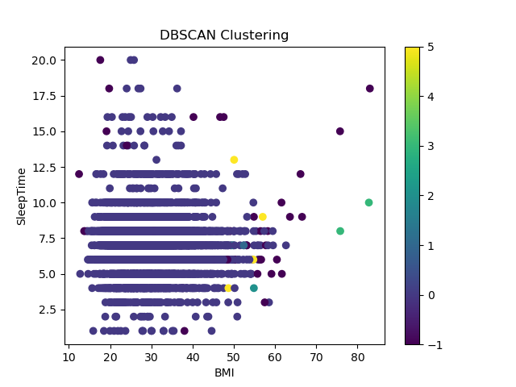
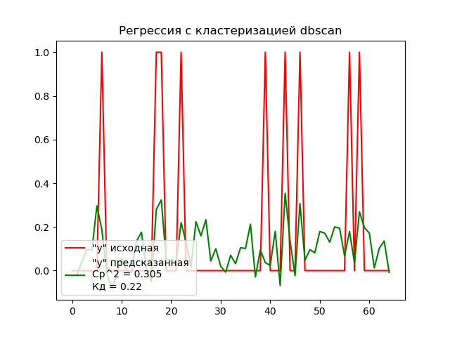
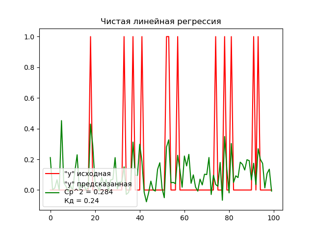

## Лабораторная работа 4. Вариант 4.
### Задание 
Использовать метод кластеризации по варианту для данных из курсовой работы. Самостоятельно сформулировав задачу. Интерпретировать результаты и оценить, насколько хорошо он подходит для 
решения сформулированной задачи.

Алгоритм кластеризации:

- Пространственная кластеризация данных с шумом на основе плотности `DBSCAN`. 

### Как запустить
Для запуска программы необходимо с помощью командной строки в корневой директории файлов прокета прописать:
```
python main.py
```
После этого в папке `static` сгенерируются 3 графика, по которым оценивается результат выполнения программы.

### Используемые технологии
- Библиотека `numpy`, используемая для обработки массивов данных и вычислений
- Библиотека `pyplot`, используемая для построения графиков.
- Библиотека `pandas`, используемая для работы с данными для анализа scv формата.
- Библиотека `sklearn` - большой набор функционала для анализа данных. Из неё были использованы инструменты:
    - `DBSCAN` - инструмент работы с моделью "Пространственная кластеризация данных с шумом на основе плотности"
    - `metrics` - набор инструменов для оценки моделей
    - `LinearRegression` - инструмент работы с моделью "Линейная регрессия"

`DBSCAN` - это алгоритм кластеризации, который используется для кластеризации данных на основе плотности, что позволяет обнаруживать кластеры произвольной формы и обнаруживать выбросы (шум). `DBSCAN` может быть полезным при предварительной обработке данных перед задачей предсказания:
 - Удаление выбросов (шума): `DBSCAN` может помочь в идентификации и удалении выбросов из данных. 
 - Генерация новых признаков: `DBSCAN` может быть использован для генерации новых признаков на основе кластеров.

### Описание работы
#### Описание набора данных
Набор данных - набор для определения возможности наличия ССЗ заболеваний у челоека

Названия столбцов набора данных и их описание:

 * HeartDisease - Имеет ли человек ССЗ (No / Yes),
 * BMI - Индекс массы тела человека (float),
 * Smoking - Выкурил ли человек хотя бы 5 пачек сигарет за всю жизнь (No / Yes),
 * AlcoholDrinking - Сильно ли человек употребляет алкоголь (No / Yes),
 * Stroke - Был ли у человека инсульт (No / Yes),
 * PhysicalHealth - Сколько дней за последний месяц человек чувствовал себя плохо (0-30),
 * MentalHealth - Сколько дней за последний месяц человек чувствовал себя удручённо (0-30),
 * DiffWalking - Ииспытывает ли человек трудности при ходьбе (No / Yes),
 * Sex - Пол (female, male),
 * AgeCategory - Возрастная категория (18-24, 25-29, 30-34, 35-39, 40-44, 45-49, 50-54, 55-59, 60-64, 65-69, 70-74, 75-79, 80 or older),
 * Race - Национальная принадлежность человека (White, Black, Hispanic, American Indian/Alaskan Native, Asian, Other),
 * Diabetic - Был ли у человека диабет (No / Yes),
 * PhysicalActivity - Занимался ли человек спротом за последний месяц (No / Yes),
 * GenHealth - Общее самочувствие человека (Excellent, Very good, Good, Fair, Poor),
 * SleepTime - Сколько человек в среднем спит за 24 часа (0-24),
 * Asthma - Была ли у человека астма (No / Yes),
 * KidneyDisease - Было ли у человека заболевание почек (No / Yes),
 * SkinCancer - Был ли у человека рак кожи (No / Yes).

Ссылка на страницу набора на kuggle: [Indicators of Heart Disease](https://www.kaggle.com/datasets/kamilpytlak/personal-key-indicators-of-heart-disease/data)

#### Формулировка задачи
Согласно прописанным в литературе варантам использования, `DBSCAN` может помочь в идентификации и удалении выбросов из данных, а также может быть использован для генерации новых признаков на основе кластеров. Исходя из этого сформулируем задачу:
> "В наборе данных с помощью `DBSCAN` определить и исключить строки содержащие шум, а также сгенерировать новый признак для данных на сонове кластеров. Проверить результат через решение задачи предсказания моделью линейной регрессии на исходных и модифицированных данных"

#### Использование алгоритма `DBSCAN`
Чтобы эффективно использовать алгоритм `DBSCAN` необходимо правильно определить два параметра: `eps` - радиус окрестности вокруг каждой точки и `min_samples` - минимальное количество точек, которые должны находиться в окрестности, чтобы рассматривать ее как ядро кластера.

Начнём с получения датасета из csv файла и признаков кластеризации:
```python
df = pd.read_csv(filein, sep=',').iloc[0:10000]
x = df.drop("HeartDisease", axis=1)
```
> **Warning**
>
> Алгоритм `DBSCAN` - очень жадная по памяти программа. В худшем случае алгоритм может занимать Q(N^2) оперативной памяти устройства, поэтому исследование получится провести лишь на частичной выборке в 10000 строк данных.

Для нахождения оптимального значения параметра `eps` воспользуемся методом рассчёта средней плотности данных. Для этого необходимо найти суммы максимальных и минимальных значений каждого признака и взять среднее арифметическое этих двух значений:

```python
eps_opt = (x.max().values.mean() + x.min().values.mean()) / 2
```
Оптимальное значение параметра `min_samples` будем искать эмпирически. Условимся, что нам будет достаточно разделить высе данные на 6 кластеров (пусть это будут степени риска возникновения ССЗ), но нам нельзя терять в качестве выбросов более 10% данных. Тогда мы будем варьировать параметр `min_samples` от 1 до кол-ва всех данных и закончим эксперимент при выполнении одного из указанных условий:

```python
developed_data = []
    for i in range(len(x)):
        if i == 0:
            continue
        dbscan = DBSCAN(eps=eps_opt, min_samples=i) 
        clusters = dbscan.fit_predict(x.values)
        if len(set(clusters)) <= 7:
            developed_data = clusters
            break
        if list(clusters).count(-1) / len(clusters) >= 0.1:
            developed_data = clusters
            break
```

Таким образом в массиве `developed_data` мы получим значение кластеров для каждй строки датасета. Добавим её как дополнительный признак.

График кластеров для значений датасета:



#### Решение задачи предсказания
Создадим два обучающих модуля. В 1м удалим все строки с кластером `-1`, что указывает на то, что они шум и воспользуемся дополнительным признаком `DBSCAN`:
```python
df_mod = df.loc[df["DBSCAN"] != -1]
x_train_mod = df_mod.drop("HeartDisease", axis=1).iloc[0:round(len(df) / 100 * 99)]
y_train_mod = df_mod["HeartDisease"].iloc[0:round(len(df) / 100 * 99)]
x_test_mod = df_mod.drop("HeartDisease", axis=1).iloc[round(len(df) / 100 * 99):len(df)]
y_test_mod = df_mod["HeartDisease"].iloc[round(len(df) / 100 * 99):len(df)]
```
Во 2м модуле для разделения на выборки оставим исходные данные:
```python
x_train = df.drop(["HeartDisease", "DBSCAN"], axis=1).iloc[0:round(len(df) / 100 * 99)]
y_train = df["HeartDisease"].iloc[0:round(len(df) / 100 * 99)]
x_test = df.drop(["HeartDisease", "DBSCAN"], axis=1).iloc[round(len(df) / 100 * 99):len(df)]
y_test = df["HeartDisease"].iloc[round(len(df) / 100 * 99):len(df)]
``` 
Создаим две модели регрессии и на каждой решим задачу предсказания. Вычислим ошибки и построим графики.

График решения задачи предсказания на модифицированных данных:



График решения задачи предсказания на исходных данных:



### Вывод
Согласно графиком, модель, обученная на исходных данных показала результат лучше, чем модель, обученная на модифицированных данных. Получается, что на данном наборе, используя алгоритм `DBSCAN`, мы не только невероятно увеличиваем затратность памяти на обучение модели, но и отрицательно влияем на результат её работы. Это означает, что использование алгоритма на таком наборе данных абсолютно нецелесообразно. 

Связанно это может быть с большим количеством бинарных признаков в данных. В таких случаях задачи кластеризации решаются сравнительно хуже.