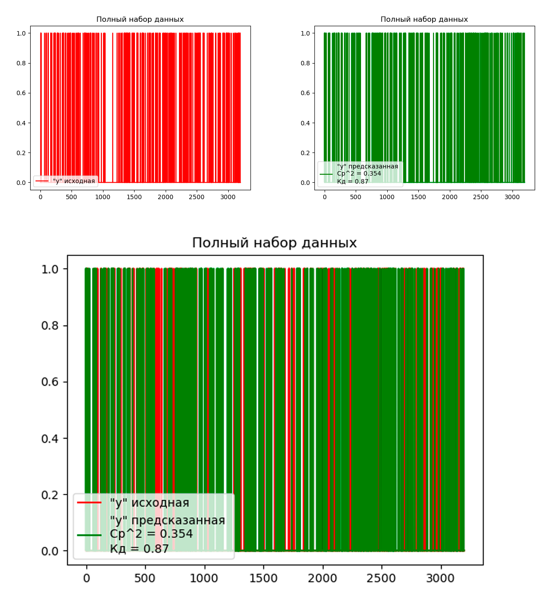
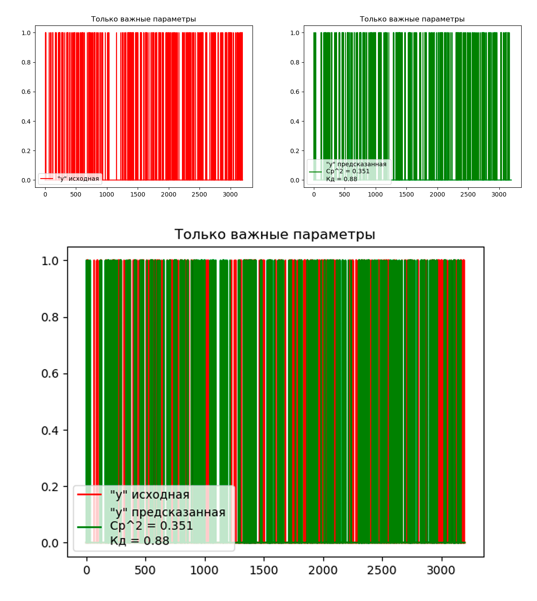

## Лабораторная работа 3. Вариант 4.
### Задание 
Выполнить ранжирование признаков  и решить с помощью библиотечной реализации дерева решений 
задачу классификации на 99% данных из курсовой работы. Проверить 
работу модели на оставшемся проценте, сделать вывод.

Модель:

- Дерево решений `DecisionTreeClassifier`. 

### Как запустить
Для запуска программы необходимо с помощью командной строки в корневой директории файлов прокета прописать:
```
python main.py
```
После этого в папке `static` сгенерируются 2 графика, по которым оценивается результат выполнения программы.

### Используемые технологии
- Библиотека `numpy`, используемая для обработки массивов данных и вычислений
- Библиотека `pyplot`, используемая для построения графиков.
- Библиотека `pandas`, используемая для работы с данными для анализа scv формата.
- Библиотека `sklearn` - большой набор функционала для анализа данных. Из неё были использованы инструменты:
    - `DecisionTreeClassifier` - инструмент работы с моделью "Дерево решений"
    - `metrics` - набор инструменов для оценки моделей
    - `MinMaxScaler` - инструмент масштабирования значений в заданный диапазон

### Описание работы
#### Описание набора данных
Набор данных - набор для определения возможности наличия ССЗ заболеваний у челоека

Названия столбцов набора данных и их описание:

 * HeartDisease - Имеет ли человек ССЗ (No / Yes),
 * BMI - Индекс массы тела человека (float),
 * Smoking - Выкурил ли человек хотя бы 5 пачек сигарет за всю жизнь (No / Yes),
 * AlcoholDrinking - Сильно ли человек употребляет алкоголь (No / Yes),
 * Stroke - Был ли у человека инсульт (No / Yes),
 * PhysicalHealth - Сколько дней за последний месяц человек чувствовал себя плохо (0-30),
 * MentalHealth - Сколько дней за последний месяц человек чувствовал себя удручённо (0-30),
 * DiffWalking - Ииспытывает ли человек трудности при ходьбе (No / Yes),
 * Sex - Пол (female, male),
 * AgeCategory - Возрастная категория (18-24, 25-29, 30-34, 35-39, 40-44, 45-49, 50-54, 55-59, 60-64, 65-69, 70-74, 75-79, 80 or older),
 * Race - Национальная принадлежность человека (White, Black, Hispanic, American Indian/Alaskan Native, Asian, Other),
 * Diabetic - Был ли у человека диабет (No / Yes),
 * PhysicalActivity - Занимался ли человек спротом за последний месяц (No / Yes),
 * GenHealth - Общее самочувствие человека (Excellent, Very good, Good, Fair, Poor),
 * SleepTime - Сколько человек в среднем спит за 24 часа (0-24),
 * Asthma - Была ли у человека астма (No / Yes),
 * KidneyDisease - Было ли у человека заболевание почек (No / Yes),
 * SkinCancer - Был ли у человека рак кожи (No / Yes).

Ссылка на страницу набора на kuggle: [Indicators of Heart Disease](https://www.kaggle.com/datasets/kamilpytlak/personal-key-indicators-of-heart-disease/data)

#### Оцифровка и нормализация данных
Для нормальной работы с данными, необходимо исключить из них все нечисловые значения. После этого, представить все строковые значения параметров как числовые и очистить датасет от "мусора". Для удаления нечисловых значений воспользуемся функцией `.dropna()`. Мы исключаем строки с нечисловыми значениями, поскольку данные предварительно были очищены (указано в описании датасета) и строк данных достаточно с избытком для обучение модели: `400.000`.

После этого, переведём все строковые значения данных в числовые методами прямой оцифровки, разделения на группы, ранжирования.

Процесс оцифровки данных столбцов со строковыми значениями:

- Имеет ли человек ССЗ (0 / 1)
- Выкурил ли человек хотя бы 5 пачек сигарет за всю жизнь (0 / 1)
- Сильно ли человек употребляет алкоголь (0 / 1)
- Был ли у человека инсульт (0 / 1)
- Ииспытывает ли человек трудности при ходьбе (0 / 1)
- Пол (Ж - 0 / М - 1)
- Возрастная категория (средний возраст каждого диапазона)
- Национальная принадлежность человека
    - White - Европиойды - 0
    - Black - Негройды - 1
    - Hispanic - Испанцы - 2
    - American Indian/Alaskan Native - Индусы - 3
    - Asian - Азиаты - 4
    - Other - Другие - 5
- Был ли у человека диабет (0 / 1)
- Занимался ли человек спротом за последний месяц (0 / 1)
- Общее самочувствие человека
    - Excellent - Отлично - 4
    - Very good - Очень хорошо - 3
    - Good - Хорошо - 2
    - Fair - Нормально - 1
    - "Poor" / "Other..." - Плохое или другое - 0
- Была ли у человека астма (0 / 1)
- Было ли у человека заболевание почек (0 /1)
- Был ли у человека рак кожи (0 / 1)

После оцифровки значений необходимо избавиться от строк с возможными остаточнымии данными ("мусором"). Для этого переведём автоматически все значения датасета в числовые функцией `to_numeric` и непереводимые отметим как `NaN` (параметр `errors='coerce'`). После снова сотрём строки содержащие нечисловые значения методом `.dropna()` и сохраним нормализованный датасет в новый csv файл:
```python
df = df.applymap(pd.to_numeric, errors='coerce').dropna()
df.to_csv(fileout, index=False)
```

#### Выявление значимых параметров
В выбранном датасете параметром предсказания `y` выступает столбец данных `HeartDisease`. Остальные столбцы считаются параметрами для решения задачи предсказания `x`, которые необходимо проранжировать по важности. Чтобы разделить выборку данных на обучаемую и тестовую, воспользуемся функцией `.iloc`. 
```python
x_train = df[["BMI", "Smoking", "AlcoholDrinking", "Stroke", "PhysicalHealth",
            "MentalHealth", "DiffWalking", "Sex", "AgeCategory", "Race", "Diabetic",
            "PhysicalActivity", "GenHealth", "SleepTime", "Asthma", "KidneyDisease", "SkinCancer"]].iloc[
              0:round(len(df) / 100 * 99)]
y_train = df["HeartDisease"].iloc[0:round(len(df) / 100 * 99)]
x_test = df[["BMI", "Smoking", "AlcoholDrinking", "Stroke", "PhysicalHealth",
            "MentalHealth", "DiffWalking", "Sex", "AgeCategory", "Race", "Diabetic",
            "PhysicalActivity", "GenHealth", "SleepTime", "Asthma", "KidneyDisease", "SkinCancer"]].iloc[
              round(len(df) / 100 * 99):len(df)]
y_test = df["HeartDisease"].iloc[round(len(df) / 100 * 99):len(df)]
```
Где `round(len(df) / 100 * 99)` - 99ти процентная строка в датасете.

Теперь, обучим модель на данных `x_train` и `y_train` и получим значимость каждого признака в модели с помощью метода `.feature_importances_`. После отмасштабируем значения важности признаков.
```python
ranks = np.abs(dtc.feature_importances_)
minmax = MinMaxScaler()
ranks = minmax.fit_transform(np.array(ranks).reshape(len(x_train.columns), 1)).ravel()
ranks = map(lambda x: round(x, 2), ranks)
ranks = dict(zip(x_train.columns, ranks))
ranks = dict(sorted(ranks.items(), key=lambda x: x[1], reverse=True))
```

Чтобы отсеять значимые параметры от незначимых, условимся, что параметры, с оценкой значимости меньше `0.05` будут считаться незначимыми. Выведем список параметров с пометками:
```
X ranging results: 
 * BMI: 1.0 - Approved
 * SleepTime: 0.26 - Approved
 * PhysicalHealth: 0.18 - Approved
 * GenHealth: 0.16 - Approved
 * MentalHealth: 0.15 - Approved
 * AgeCategory: 0.14 - Approved
 * Race: 0.07 - Approved
 * PhysicalActivity: 0.06 - Approved
 * Stroke: 0.04 - Eliminated
 * Smoking: 0.03 - Eliminated
 * Asthma: 0.03 - Eliminated
 * SkinCancer: 0.03 - Eliminated
 * DiffWalking: 0.02 - Eliminated
 * Sex: 0.02 - Eliminated
 * AlcoholDrinking: 0.0 - Eliminated
 * Diabetic: 0.0 - Eliminated
 * KidneyDisease: 0.0 - Eliminated
```

Где `Approved` - параметр значим и будет использоваться в предсказании, а `Eliminated` - параметр незначим и будет исключён.

#### Решение задачи кластеризации на полном наборе признаков 
Чтобы решить задачу кластеризации моделью `DecisionTreeClassifier`, воспользуемся методом `.predict()`. Оценку качества решения и графики будем строить теми же методами, что в 1й лабораторной работе.

График решения задачи классификации на полном наборе признаков:



#### Решение задачи кластеризации, используя только значимые признаки
Согласно предыдущему пункту, значимыми признаками модели были выявлены:
 * BMI
 * SleepTime
 * PhysicalHealth
 * GenHealth
 * MentalHealth
 * AgeCategory
 * Race
 * PhysicalActivity
Обучим модель только с их использованием, решим задачу классификации и построим график.

График решения задачи классификации, используя только значимые признаки:



### Вывод
Согласно среднеквадратической ошибке и коэфициенту детерминации, модель, обученная только на значимых признаков отработала точнее, чем модель, обученная на полном наборе признаков. Это значит, что ранжирование было проведено верно и дало полезный результат. О логической оценке исключённых данных сказать ничего не получится, поскольку действительную зависимость результата от параметров значет только медицинский эксперт.

Исходя их общих значений точности, обе модели показали хорошие результаты и могут быть применимы к решению задачи классификации на данном наборе данных.