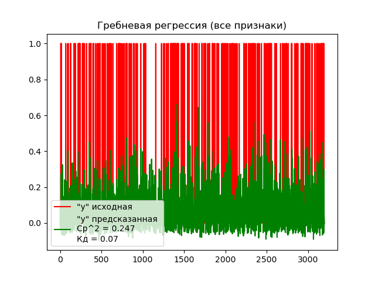
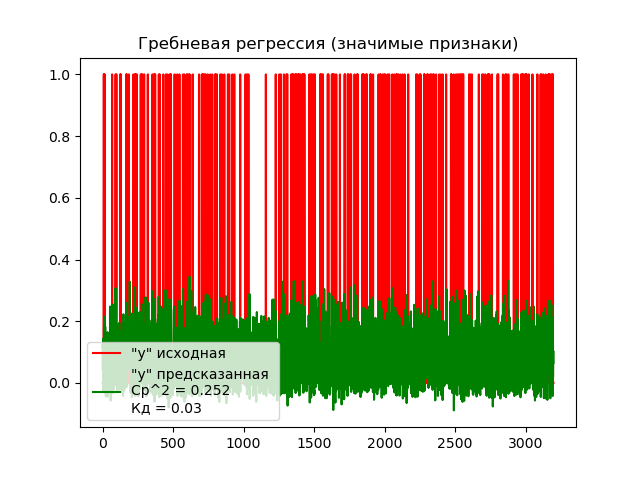

## Лабораторная работа 5. Вариант 4.
### Задание 
Использовать регрессию по варианту для данных из курсовой работы. Самостоятельно сформулировав задачу. Интерпретировать результаты и оценить, насколько хорошо он подходит для 
решения сформулированной задачи.

Модель регрессии:

- Гребневая регрессия `Ridge`. 

### Как запустить
Для запуска программы необходимо с помощью командной строки в корневой директории файлов прокета прописать:
```
python main.py
```
После этого в папке `static` сгенерируются 2 графика, по которым оценивается результат выполнения программы.

### Используемые технологии
- Библиотека `numpy`, используемая для обработки массивов данных и вычислений
- Библиотека `pyplot`, используемая для построения графиков.
- Библиотека `pandas`, используемая для работы с данными для анализа scv формата.
- Библиотека `sklearn` - большой набор функционала для анализа данных. Из неё были использованы инструменты:
    - `Ridge` - инструмент работы с моделью "Гребневая регрессия"
    - `metrics` - набор инструменов для оценки моделей

`Ridge` - это линейная регрессионная модель с регуляризацией L2, которая может быть использована для решения задачи регрессии.

### Описание работы
#### Описание набора данных
Набор данных - набор для определения возможности наличия ССЗ заболеваний у челоека

Названия столбцов набора данных и их описание:

 * HeartDisease - Имеет ли человек ССЗ (No / Yes),
 * BMI - Индекс массы тела человека (float),
 * Smoking - Выкурил ли человек хотя бы 5 пачек сигарет за всю жизнь (No / Yes),
 * AlcoholDrinking - Сильно ли человек употребляет алкоголь (No / Yes),
 * Stroke - Был ли у человека инсульт (No / Yes),
 * PhysicalHealth - Сколько дней за последний месяц человек чувствовал себя плохо (0-30),
 * MentalHealth - Сколько дней за последний месяц человек чувствовал себя удручённо (0-30),
 * DiffWalking - Ииспытывает ли человек трудности при ходьбе (No / Yes),
 * Sex - Пол (female, male),
 * AgeCategory - Возрастная категория (18-24, 25-29, 30-34, 35-39, 40-44, 45-49, 50-54, 55-59, 60-64, 65-69, 70-74, 75-79, 80 or older),
 * Race - Национальная принадлежность человека (White, Black, Hispanic, American Indian/Alaskan Native, Asian, Other),
 * Diabetic - Был ли у человека диабет (No / Yes),
 * PhysicalActivity - Занимался ли человек спротом за последний месяц (No / Yes),
 * GenHealth - Общее самочувствие человека (Excellent, Very good, Good, Fair, Poor),
 * SleepTime - Сколько человек в среднем спит за 24 часа (0-24),
 * Asthma - Была ли у человека астма (No / Yes),
 * KidneyDisease - Было ли у человека заболевание почек (No / Yes),
 * SkinCancer - Был ли у человека рак кожи (No / Yes).

Ссылка на страницу набора на kuggle: [Indicators of Heart Disease](https://www.kaggle.com/datasets/kamilpytlak/personal-key-indicators-of-heart-disease/data)

#### Формулировка задачи
Поскольку модель гребневой регрессии используется для решения задачи регресси, то попробуем на ней предсказать поведение параметров при обучении на всех признаках, и на значимых признаках, найденных ранее в лабораторной №3. Сформулируем задачу:
> "Решить задачу предсказания с помощью моделей гребневой регрессии, обученных на всех признаках и только на значимых признаках. Сравнить результаты работы моделей"

#### Решение задачи предсказания

Создадим два обучающих модуля. В 1й включим все признаки. Разделим даныые на выборки. Пусть обучающая выборка будет 99% данных, а тестовая - 1% соответсвенно:
```python
x_train = df.drop("HeartDisease", axis=1).iloc[0:round(len(df) / 100 * 99)]
y_train = df["HeartDisease"].iloc[0:round(len(df) / 100 * 99)]
x_test = df.drop("HeartDisease", axis=1).iloc[round(len(df) / 100 * 99):len(df)]
y_test = df["HeartDisease"].iloc[round(len(df) / 100 * 99):len(df)]
```
Тогда во 2м модуле используем только признаки, названные значимыми в 3й лабораторной, а именно:
 * BMI
 * SleepTime
 * PhysicalHealth
 * GenHealth
 * MentalHealth
 * AgeCategory
 * Race
 * PhysicalActivity

Обучим две модели гребневой регнессии на данных из разных модулей. Решим задачу предсказания, найдём ошибки и построим графики.

График решения задачи предсказания моделью гребневой регрессии с использованием всех признаков:



График решения задачи предсказания моделью гребневой регрессии с использованием значимых признаков:



### Вывод
Согласно графиком, среднеквадратическая ошибка обеих моделей достаточна низкая. что свидетельствует достаточно точному соответствию истиных и полученных значений, однако коэффициент детерминации моделей имеет очень низкое значение, что свидетельствует практически полному непониманию модели зависимостей в данных.
> **Note**
>
> Модель `Ridge` имеет коэффициент регуляризации `alpha`, который помогает избавиться модели от переобучения, однако даже при стандартном его значении в единицу, модель показывает очень низкий коэффициент детерминации, поэтому варьирование его значения не принесёт никаких результатов.
Исходя из полученных результатов можно сделать вывод, что модель гребневой регрессии неприменима к данному набору данных.