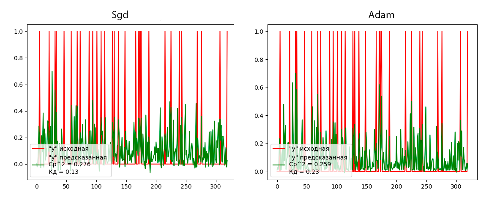

## Лабораторная работа 1. Вариант 4.
### Задание 
Построить графики, отобразить 
качество моделей, объяснить полученные результаты.

Данные: `make_moons (noise=0.3, random_state=rs)`

Модели:
- Линейная регресся 
- Полиномиальная регрессия (со степенью 4) 
- Гребневая полиномиальная регресся (со степенью 4, alpha = 1.0)

### Как запустить
Для запуска программы необходимо с помощью командной строки в корневой директории файлов прокета прописать:
```
python main.py
```
После этого в папке static сгенерируются 4 графика, по которым оценивается результат выполнения программы.

### Используемые технологии
- Библиотека `pyplot`, используемая для построения графиков. 
- Библиотека `sklearn` - большой набор функционала для анализа данных. Из неё были использованы инструменты:
    - `make_moons` -  генератор случайных структурированных данных
    - `train_test_split` - разделитель данных на обучающиую и тестовую выборки
    - `LinearRegression` - инструмент работы с моделью "Линейная регрессия"
    - `Ridge` - инструмент работы с моделью "Гребневая регрессия"
    - `PolynomialFeatures` - инструмент работы с моделью "Полиномиальная регрессия"
    - `metrics` - набор инструменов для оценки моделей
- Библиотека `numpy`, используемая для обработки массивов данных и вычислений

### Описание работы
Программа генерирует данные для обучения и тестирования моделей, стандартизирует данные и разделяет их на обучающую и тестовую выборки.
```python
X, y = make_moons(noise=0.3, random_state=None)                                                 
X = StandardScaler().fit_transform(X)                                                            
X_train, X_test, y_train, y_test = train_test_split(X, y, test_size=.4, random_state=42)
```
После чего, на данных `X_train` и `y_train` производится обучение моделей, а на данных `X_test` и `y_test` - оценка их качества.

Поскольку все модели в задании регрессионные, результаты работы будем оценивать через решение задачи предсказания. Это позволит нам использовать для оценки только `y` данные, что облегчит построение графиков.

Оценка качества моделей будет производиться по двум критериям - среднеквадратическому отклонению `mid_square` от истинного результата и коэфициенту детерминации `det_kp`. Чем среднеквадратическая ошибка меньше и чем коэфициент детерминации больше, тем лучше модель показала себя на данной выборке.
```python
mid_square = np.round(np.sqrt(metrics.mean_squared_error(y_test, y_predict)), 3)
det_kp = np.round(metrics.r2_score(y_test, y_predict), 2)
```
Где `y_predict` - решение задачи предсказания. Для наглядности, оценочные параметры округлим с помощью функции `round` до 3х и 2х знаков после запятой.

#### Линейная регрессия
Для создания модели линейной регрессии воспользуемся объектом `LinearRegression()`, обучим модель и заставим её предсказать значения `y` на тестовой выборке `x_text`.
```python
linear = LinearRegression()         
linear.fit(X_train, y_train)        
y_predict = linear.predict(X_test)
```
Построим график для оценки результатов:


#### Полиномиальная регрессия
Линейная регрессия является разновидностью полиномиальной регрессии со степенью ведущего члена равной 1. Чтобы построить модель полиномиальной регрессии со степенью 4 необходимо к данным модели линейной регрессии добавить 3 недостающих члена, возведённых в соответствующие степени 2, 3 и 4.
```python
poly = PolynomialFeatures(degree=4, include_bias=False)
x_poly_train = poly.fit_transform(X_train)
x_poly_test = poly.fit_transform(X_test)
```
Где `degree` - старшая степень полинома, `include_bias` - приведение свободного члена полинома к 0.

Обучение и прогнозирование модели далее производится также, как с моделью линейной регрессии, но уде на данных `x_poly_train` и `x_poly_test`

Построим график для оценки результатов:



#### Полиномиальная гребневая регрессия
Полиномиальная гребневая регрессия - это та же самая полиномиальная регрессия, но построенная с использованием усредняющего коэфициента. Для этого воспользуемся объёктом `Ridge()` и построим модель аналогично первым. 
```python
ridge = Ridge(alpha=1.0)
ridge.fit(x_poly_train, y_train)
y_predict = ridge.predict(x_poly_test)
```

Построим график для оценки результатов:


Теперь построим график для сравнения работы всех моделей и выберем наилучшую:


### Вывод
Наиболее низкое среднеквадратичное отклонение и наиболее высокий коэфициент детерминации показала модель линейной регрессии, а это значит что она наилучшем образом подходит для работы со сгенерированным данными. В этом случае мы можем предположить что данные выборки находятся на небольшом расстоянии друг от друга и располагаются линейно.